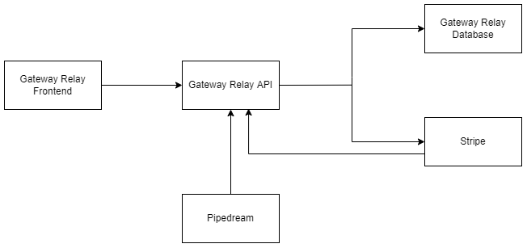

# Gateway Relay Service

## Important Information
| | |
| - | - |
|**Project Name** |**Gateway Relay Service** |
| **Technical Team** | **[Karan Khullar](https://github.com/KoderKaran) & [Todor Penchev](https://github.com/toshko3331)** |
| **Artist** | **[Halli Rosario](https://linktr.ee/mellowed.eyes)** |
| **Email** | **karan.khullar@lyxgateway.app** |
| **App Link** | **[Gateway Relay](https://www.lyxgateway.app/dashboard)** |
| **Frontend Source** | **[Gateway Relay Frontend](https://github.com/KoderKaran/gateway-relay-web-frontend)** |
| **API Source** | **[Gateway Relay API](https://github.com/KoderKaran/gateway-relay-api-layer)** |
| **Documentation** | **[Gateway Relay Documentation](https://karan-khullar.gitbook.io/gateway/)** |
| **Video Demo** | **[Gateway Relay Video Demo](https://karan-khullar.gitbook.io/gateway/guides/user-guide/gateway-relay-demo)** |
| **Backup Video Demo Link** | **[Backup Gateway Relay Video Demo](https://www.youtube.com/watch?v=7-XYlwvSs_s&ab_channel=TodorPenchev)** |

___
###### ⚠️ **_IMPORTANT NOTE_**: The overview and architecture below are a summary of what can be found in the documentation. For more in depth information, please visit the [documentation](https://karan-khullar.gitbook.io/gateway/).
___

# Overview
Gateway Relay service is an easy-to-use, low-barrier-to-entry transaction relay service for the Lukso blockchain. A user's ability to send relay transactions is measured in Gateway Credits, which can be earned in a variety of ways.

There are a multitude of free-to-earn options, as well as a very flexible subscription-based option to earn Gateway Credits. Once credits have been accumulated, they can be consumed in order to eliminate the gas fee involved with interacting with the blockchain.

### Our Mission
1. **Lowering the barrier of entry for the user as much as possible.**
2. **Strengthen and grow the Lukso ecosystem through strategic partnerships.** 

**To learn more about our mission, please go [here](https://karan-khullar.gitbook.io/gateway/introduction/about-gateway-relay-service).**

### Key Existing Functionalities
The following describe core functionalities performed by Gateway Relay at the time of writing:
1. **The ability to subscribe for any amount per month (down to the stripe limit of 50 cents).** This is done in order to ensure that the barrier of entry into the ecosystem is as small as possible for a newcomer, as well as providing flexibility for anyone already in the ecosystem. For the purposes of this demo, when a user subscribes for any amount, they will recieve 1 Gateway Credit per $.025 every month (along with other benefits, which can be found [here](https://karan-khullar.gitbook.io/gateway/guides/functionality-guide#experience)). For instance, if I subscribed for $10 a month, I would recieve 400 credits every month. 1 Gateway Credit is equivalent to 10,000 gas, which means $10 a month would net 400,000 gas for that month. ***It is important to note, that these numbers (the cost per one Gateway Credit, as well as the amount of gas one Gateway Credit correlates to is for testing purposes only, and is subject to change.***
2. **The ability to earn Gateway Credits in a variety of free to earn methods.** This gives users the freedom to trade their time, rather than their money, to participate in the Lukso ecosystem. By having control over what a user spends in order to earn Gateway credits, the barrier of entry into the ecosystem is reduced substantially. ***For more information, please visit this [page](https://karan-khullar.gitbook.io/gateway/guides/functionality-guide#credit-sources) in the documentation. Below are the currently existing free-to-earn methods, with more on the way:***
	* **Offerwall offers:** This can be anything from downloading an app, to signing up to for an external service.
	* **Surveys:** Users can participate in surveys, that will reward users based on how long or difficult they were.
	* **Videos:** Users can watch short ad videos, usually 30-60 seconds a piece to earn credits.
	* **Daily Check-Ins:** Users can perform daily check-in's a set amount of times per day. Each check-in will show an ad, and then reward the user. They have a chance of getting some credits, some experience, or a modifier. Badges can increase the number of times a user can check in. ***Learn more about experience, modifiers, and badges [here](https://karan-khullar.gitbook.io/gateway/guides/functionality-guide#experience).***
3. **The ability to utilize Gateway Credits in order to send transactions throughout the Lukso blockchain, without paying for the gas fees.** Gateway Relay provides a few endpoints to make the process intuitive. ***The brief summary of the endpoints are below, with more information [here](https://karan-khullar.gitbook.io/gateway/reference/api-reference/relay):*** 
	*   **/api/relay/execute:** By making a post request to this endpoint, the user can execute a relay transaction. This endpoint will ensure the user has enough Gateway Credits before executing the transaction, and if they don't, they will recieve an error. If the execution succeeds, they will recieve the transaction hash of the resulting transaction.
	* **/api/relay/quota:** By making a post request to this endpoint, the user can get information regarding their total credit amount, as well as how many credits they will recieve as a subscription payout, and when that next payout is.
	* **/api/relay/transactionStatus:** By making a post request to this endpoint, the user will be able to see the status of any transaction sent through the Gateway Relay API. They will also be able to see how many credits were used by this transaction, as well as what their credits were before and after the transaction.

### Key Roadmap Items
___
⚠️ **_IMPORTANT NOTE_**: ***For the full list, as well as in depth explanations for each item on the roadmap, please visit the roadmap section in the [documentation](https://karan-khullar.gitbook.io/gateway/roadmap/roadmap).***
___
Below is a list that describes key items on the roadmap for Gateway Relay:
1. **Partnership Program:** A major priority for Gateway Relay is to establish partnerships, in order to bolster user engagement with the partners, and in turn creating a stronger, and more intertwined ecosystem. To meet this goal, Gateway Relay will have in place benefits for partners. These benefits may include the following: 
	* Offers/Surveys/Videos that center around the partner in order to incentivize users to engage with the partner.
	* Set periods of time where users who interact with the partner get heavily discounted or free transactions.
	* Bulk discounts on Gateway Credits.

**For a full comprehensive guide on the Partner Program, please go [here](https://karan-khullar.gitbook.io/gateway/guides/partner-program-guide).**

2. **UP-Less Temporary User:** A mechanism for users who are so new to the Lukso ecosystem, that they don't have a Universal profile. Instead of overwhelming them by having them install the UP extension and generating them a UP, we would have infrastructure in place to allow a gradual build up to them getting a UP. This would involve them "soft authenticating", and instead of using their UP address, they would use a unique identifier generated for them. Using this unique identifier, users would be registered as temporary users, and can login to see their dashboard, earn credits and earn experience for their permanent badge. 

**To learn more about Temporary Users, please go [here](https://karan-khullar.gitbook.io/gateway/roadmap/roadmap/very-high-priority-items/up-less-temporary-user).**

3. **Ability to Send Credits to Others:** The ability to send credits to other users is pivitol in order for each user to have full control over what they can do with their credits. If done correctly, this mechanic can also lead to the growth of the number of people in the Lukso ecosystem, as well as the number of connections formed in the community. One way this can be utilized to not only make the new user experience better, it can give use to any excess credits a user may have lying around that wouldn't have been used anyway.

**To learn more about sending credits to others, please go [here](https://karan-khullar.gitbook.io/gateway/roadmap/credit-sources/sending-credits-to-others).**

### High Level Architecture

**For a more in depth explanation into the architecture, please go [here](https://karan-khullar.gitbook.io/gateway/architecture/gateway-relay-architecture).**

